**中文版（Chinese version）**

## 目录

- [一、项目概览](#一项目概览)
- [二、软件部分](#二软件部分)
  - [神经网络软件部分](#神经网络软件部分)
  - [验证代码](#验证代码)
- [三、硬件部分](#三硬件部分)
  - [加速器硬件架构](#加速器硬件架构)
  - [Vivado加速器工程文件](#vivado加速器工程文件)
  - [主要模块说明](#主要模块说明)
    - [system\_top.v](#system_topv)
      - [central\_control.sv](#central_controlsv)
      - [counter\_dw.v](#counter_dwv)
      - [mac\_array\_x9.v](#mac_array_x9v)
        - [mac\_array.v](#mac_arrayv)
      - [BRAM\_DMA.v](#bram_dmav)
        - [divider.v](#dividerv)
      - [Kernel\_Bram\_DMA.v](#kernel_bram_dmav)
      - [softmax.v](#softmaxv)
- [四、运行及复现](#四运行及复现)
  - [软件执行验证](#软件执行验证)
  - [.coe文件生成](#coe文件生成)
  - [加速器行为级仿真与验证](#加速器行为级仿真与验证)
  - [Linux主机与VC709通信实现PCIe数据传输](#linux主机与vc709通信实现pcie数据传输)
    - [XDMA IP Config](#xdma-ip-config)
    - [AXI Clock Converter Config](#axi-clock-converter-config)
    - [AXI BRAM Controller Config](#axi-bram-controller-config)
    - [Clocking Wizard Config](#clocking-wizard-config)
    - [Constant Config](#constant-config)
    - [地址配置](#地址配置)
    - [主机与FPGA板连接](#主机与fpga板连接)
  - [上板验证](#上板验证)
  - [图形化界面](#图形化界面)
- [五、一些问题的解决过程](#五一些问题的解决过程)
  - [硬件设计的结果与pytorch模型的输出结果不一致](#硬件设计的结果与pytorch模型的输出结果不一致)
  - [报错: RuntimeError: Quantized backend not supported](#报错-runtimeerror-quantized-backend-not-supported)
  - [机箱短路](#机箱短路)
  - [无法开机](#无法开机)
  - [编译xdma报错mmiowb相关问题](#编译xdma报错mmiowb相关问题)
  - [运行load\_driver.sh脚本报错: `not found.sh: 3`:](#运行load_driversh脚本报错-not-foundsh-3)
  - [0地址读写出错](#0地址读写出错)
  - [读写数据不匹配，不匹配位置随机发生](#读写数据不匹配不匹配位置随机发生)
  - [读数据错位](#读数据错位)
- [六、项目背景](#六项目背景)

# 一、项目概览


本项目实现了一个 **基于 FPGA 的 MobileNetV2 推理加速器**，通过对网络进行量化并在硬件中实现并行计算结构，从而加速 ImageNet 图像分类推理。硬件平台为 Xilinx VC709 FPGA 开发板。

软件部分基于 NumPy 实现了量化 MobileNetV2 的完整推理流程，并提供逐层输出机制，用于与硬件计算结果进行对比验证。

硬件加速器采用多路 MAC 阵列实现并行计算，并配套设计了与计算阵列数量一致的 BRAM 存储结构，以支撑并行数据访问与计算执行。

在 ImageNet 验证集上的实验结果如下：
- Top-1 Accuracy：**71.61%**
- Top-5 Accuracy：**90.11%**

相关方法参考以下论文：
- MobileNetV2: Inverted Residuals and Linear Bottlenecks 
  *Mark Sandler et al., CVPR 2018*
- Quantization and Training of Neural Networks for Efficient Integer-Arithmetic-Only Inference  
  *Benoit Jacob et al., CVPR 2018*

<!-- The Image classifier trained on the ImageNet dataset with the backbone of MobileNet-V2. The demo is built on the Xilinx VC709 evaluation board.

量化方法参考 B.Jacob:"Quantization and Training of Neural Networks for Efficient Integer-Arithmetic-Only Inference"。其中M0,M1分别为weight tensor与bias的缩放因子系数。 -->


# 二、软件部分

## 神经网络软件部分
.jpg、.JPEG文件为神经网络的输入，.npy、.pkl文件为参数M0、M1的数据PT文件用于保存模型,Imagenet_classes用于输出判断结果。

---
**量化MobileNetV2推理**
- **conv_round.py & conv_accelerate.py**
定义了基本的卷积运算函数（普通卷积、深度卷积、点卷积）和shortcut函数。
  - **conv_round.py**:使用循环嵌套的方式实现卷积
  - **conv_accelerate.py**:使用了向量化运算进行加速。

- **layer1_to_layer53_M_V1.py & MobileNetV2_numpy_simplified.py**
代码的核心部分，复现量化MobileNetV2神经网络的推理过程。
  - **layer1_to_layer53_M_V1.py**:比较冗杂，将每一层的参数配置和计算都写出来了，因此可以轻易的针对某一层进行修改。
  - **MobileNetV2_numpy_simplified.py**:前者的基础上简化的版本，使用循环来简化中间的bottleneck部分，代码量少了很多。

  由于两者调用的是`conv_round.py`，因此计算速度很慢，推理一张图需要数分钟。

- **MobileNetV2_numpy_accelerate.py**
调用`conv_accelerate.py`,使用向量化运算对神经网络进行了加速，加速后一秒内就可以推理完一张图。运行过程中会将每一层的输出保存为.npy文件并放到`outputs/`文件夹。

- **MobileNetV2_numpy_wrapper.py & MobileNetV2_numpy_imagenet.py**
  - **MobileNetV2_numpy_wrapper.py** :将模型包装为函数,调用`conv_accelerate.py`进行加速。
  - **MobileNetV2_numpy_imagenet.py**：在Imagenet验证集上测试该模型的图像分类能力，使用前需设置验证集路径。

---
**numpy模型与torchvision模型对比**
- **compare_numpy_torchvision.py**
将torchvision模型中每一层的输入给到numpy模型中得到每一层的输出结果并进行比对，从而得到numpy模型的每一层输出与torchvision模型的差异。

---
**.coe文件生成**
- **coe_generate.py**
位于coe文件夹中，用于将每一层的M1、weight的.p文件转化为对应bram的txt文件用于初始化。txt文件可以在硬件设计的部分中使用`change.bat`转换成.coe文件。

---


## 验证代码


- **bram_reshape.py**
用于将vivado运行之后写出的bram.txt文件中的结果重组为每一层的输出结果，并作为npy文件保存到outputs文件夹中。只需要说明每一层的形状和地址范围即可。需要与仿真得到的txt文件处在同一文件夹。

- **compare_hardware_software_output.py**
位于outputs文件夹中。当运行了`MobileNetV2_numpy_accelerate.py`和`bram_reshape.py`这两个程序后，outputs文件夹中有存有神经网络的每一层输出的.npy文件。此时再运行该代码即可比较每一层的输出，比较结果会存储到comparison_results文件夹中。

---

# 三、硬件部分
## 加速器硬件架构
本节从整体角度介绍 FPGA 加速器的计算与存储架构设计。

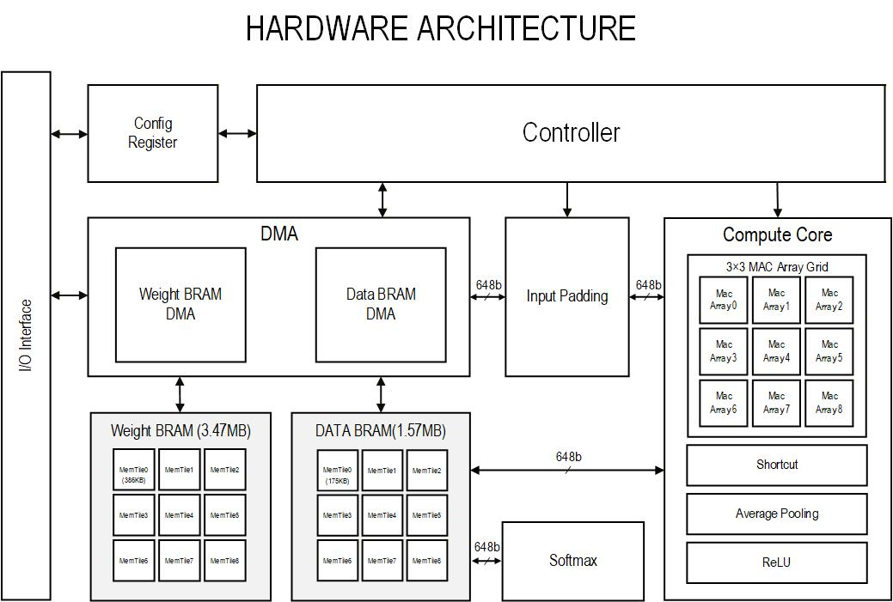

由于MobileNetV2中普通卷积和深度卷积的卷积核尺寸均为3*3，因此本项目使用了9个BRAM来进行权重的存储。与此对应的也设计了9个BRAM对激活值进行存储，9个乘加阵列来进行计算。

---

## Vivado加速器工程文件
下图展示了加速器的 RTL 层级结构
```text
system_top (system_top.v)                            # 顶层模块
├── clk_gen_0                   (clk_wiz_0.xci)      # 时钟 IP
├── central_control             (central_control.sv) # 配置寄存器
├── counter_dw0                 (counter_dw.v)       # 控制器 & 数据预处理模块

├── mac_array_x9                (mac_array_x9.v)    # 计算子系统
│   ├── mode_arbiter0           (mode_arbiter.v)    # 阵列内部模式仲裁 / 控制
│   │   ├── ReLUandShift0~2     (ReLUandShift.v)    # ×3（普通卷积）
│   │   └── ReLUandShift_DW0~8  (ReLUandShift.v)    # ×9（DW & PW 使用）
│   └── mac_array1~9         (mac_array.v)          # 乘加阵列
│       ├── MAC1~9           (MAC.v)                # 乘加运算单元
│       ├── adder_tree_9     (adder_tree_9.v)       # 加法树
│       ├── shortcut         (shortcut.v)           # shortcut 模块
│       ├── m0xsigma_plus_m1 (m0xsigma_plus_m1.v)   # 量化处理模块
│       └── avgpool          (avgpool.v)            # 平均池化模块

├── BRAM_DMA0                (BRAM_DMA.v)           # 数据 BRAM-DMA
│   ├── Divider[*]           (divider.v)            # 除法器
├── Kernel_Bram_DMA0         (Kernel_Bram_DMA.v)    # 权重 BRAM-DMA

├── u_softmax                (softmax.v)            # softmax 模块
│   └── u_div                (div_gen_0.xci)        # 除法 IP

├── Data_Bram_0~8            (*.xci)                # 数据 BRAM
└── Kernel_Bram_0~*          (*.xci)                # 权重 BRAM

```

---------------------
## 主要模块说明
### system_top.v
加速器顶层模块，负责各子模块的集成、全局信号连接以及整体控制流程的组织。

---------------------
#### central_control.sv

配置寄存器模块，用于存储 MobileNetV2 各层的配置信息，包括：

- M0参数

- 输入 / 输出特征图起始地址

- shortcut 起始地址

- M1起始地址

- 输入 / 输出零点

- 特征图通道数与尺寸

- stride

- 操作类型（普通卷积、深度卷积、点卷积、shortcut、平均池化、softmax）

---
#### counter_dw.v
加速器的核心控制模块，负责整体数据流调度与时序控制，同时完成输入数据的预处理。

---
#### mac_array_x9.v
计算子系统顶层模块，内部包含 9 个并行的 `mac_array`，用于实现加速器的主要计算功能。

##### mac_array.v
乘加阵列模块，每个实例包含 9 个 MAC 运算单元。

- **MAC.v**
基本乘加运算模块，实现乘法与累加功能。

- **adder_tree_9.v**
九输入加法树模块，用于将 9 个 MAC 输出进行归约。
采用流水线结构，每次计算耗时 4 个时钟周期。

- **avgpool.v**
平均池化模块，实现平均池化操作。

- **shortcut.v**
残差连接模块，用于实现不同层输出之间的 shortcut 连接。

- **m0xsigma_plus_m1.v**
量化处理模块，实现 M0 * x + M1 运算，用于完成各层输出的缩放与量化。

- **mode_arbiter.v**
计算结果处理与拼接模块，负责不同计算模式下输出数据的选择与组织，内部包含多个 `ReLUandShift` 模块。
  - **ReLUandShift.v**
实现 ReLU 激活与移位操作的基础模块。

---

#### BRAM_DMA.v
数据BRAM的DMA模块，负责输入/输出地址的计算以及输入数据顺序的重排。
##### divider.v
除法器模块，采用流水线结构，每次计算耗时 2 个时钟周期。用于DMA中地址偏移的计算。

---
#### Kernel_Bram_DMA.v
权重 BRAM 的 DMA 控制模块，负责卷积权重及 M1 参数的地址生成与访问控制。

---

#### softmax.v
softmax 模块，用于实现网络最后一层的 softmax 计算。

---


# 四、运行及复现
## 软件执行验证
1.配置python运行环境（Numpy/torchvision/...)
2.运行`MobileNetV2_numpy_accelerate.py`文件，运行成功会得到下列结果。程序会打印出top5的类别以及概率。
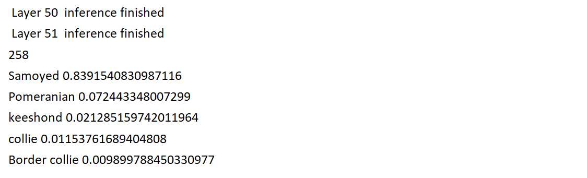
如果希望能够得到该神经网络的accuracy，可以在下载Imagenet验证集后运行`MobileNetV2_numpy_imagenet.py`。结果为：
- Top-1 Accuracy：**71.61%**
- Top-5 Accuracy：**90.11%**

具体打印信息保存在Validating.txt文件中。

---
## .coe文件生成
在coe文件夹中，存有每一层的权重和M1参数的.p文件。运行coe_generate可以得到9个存有权重的txt文件和1个存有M1的txt文件。此外，还有一个layer_addresses.txt文件，其中存储了每一层的权重和M1在BRAM中的地址。

---

## 加速器行为级仿真与验证
在Xilinx Vivado中，打开加速器工程项目。进行行为级仿真后，可以在`mobilenetv2_tcasii.sim`文件夹中找到生成的bram0.txt~bram8.txt文件。将这些文件拷贝到`MobileNetV2_numpy`文件夹中，并先后运行`bram_reshape.py` 和 `compare_hardware_software_output.py`之后，程序会打印出每一层的输出结果是否相等，如下图所示。
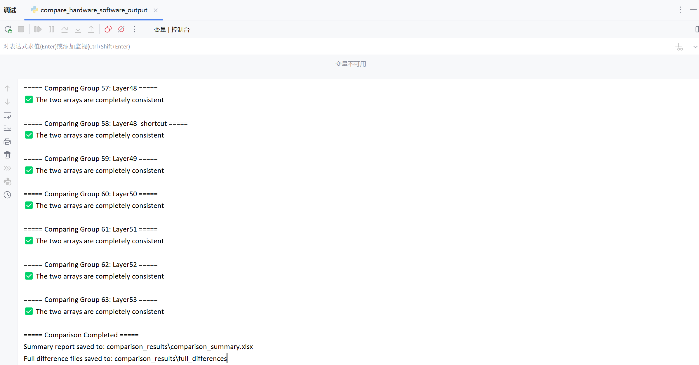

---


## Linux主机与VC709通信实现PCIe数据传输
本项目已经完成了从加速器与FPGA的通信，因此直接进行Implementation之后就可以开始上板验证。如果希望能替换为自己的加速器，可以参考以下配置过程。此部分主要参考[WangXuan95/Xilinx-FPGA-PCIe-XDMA-Tutorial: Xilinx FPGA PCIe 保姆级教程 ——基于 PCIe XDMA IP核](https://github.com/WangXuan95/Xilinx-FPGA-PCIe-XDMA-Tutorial)。


整体的实现过程为：
PCIe --- DMA/Bridge --- AXI --- AXI Clock Converter --- AXI BRAM Controller
其中DMA用于将PCIe信号转为AXI信号，通过AXI Clock Converter实现不同时钟域的AXI信号变换，再通过AXI BRAM Controller来实现对加速器的控制。整体框图如下所示：

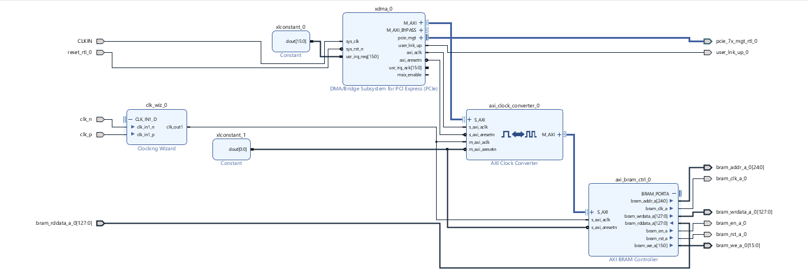

以下为具体的配置：

---

### XDMA IP Config
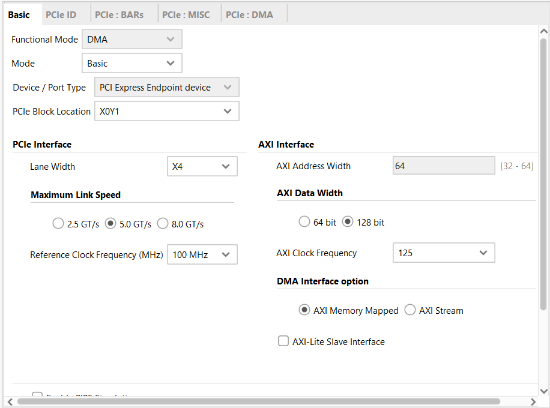
配置如上所示，
	Mode选择basic即可
	PCIe Block Location：决定了block在芯片中的物理位置，可以根据自己的时序情况灵活选择
	Lane Width：按需选择，目前的延长线支持到X8
	Link Speed：代表的是 PCIe 的速率，可以自由指定，2.5 GT/s 代表 PCIe Gen1， 5.0 GT/s 代表 PCIe Gen2，8.0 GT/s 代表 PCIe Gen3 。本例中取 5.0 GT/s
	AXI Data Width：是 AXI 总线中数据总线的宽度，也即一个周期最多可以读/写的比特数量。可以自由指定，但要和 AXI slave 保持一致。本例中取 128 bit。
	AXI Clock Frequency：AXI 总线的时钟频率，可以自由指定，只要 AXI slave 能工作在这个频率下就行
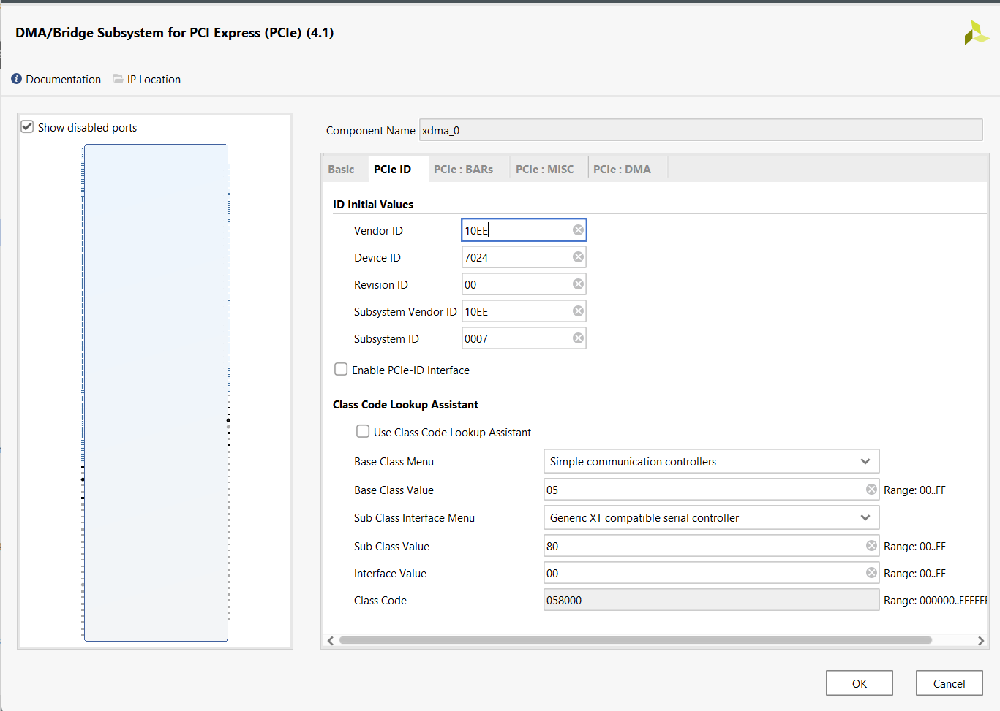
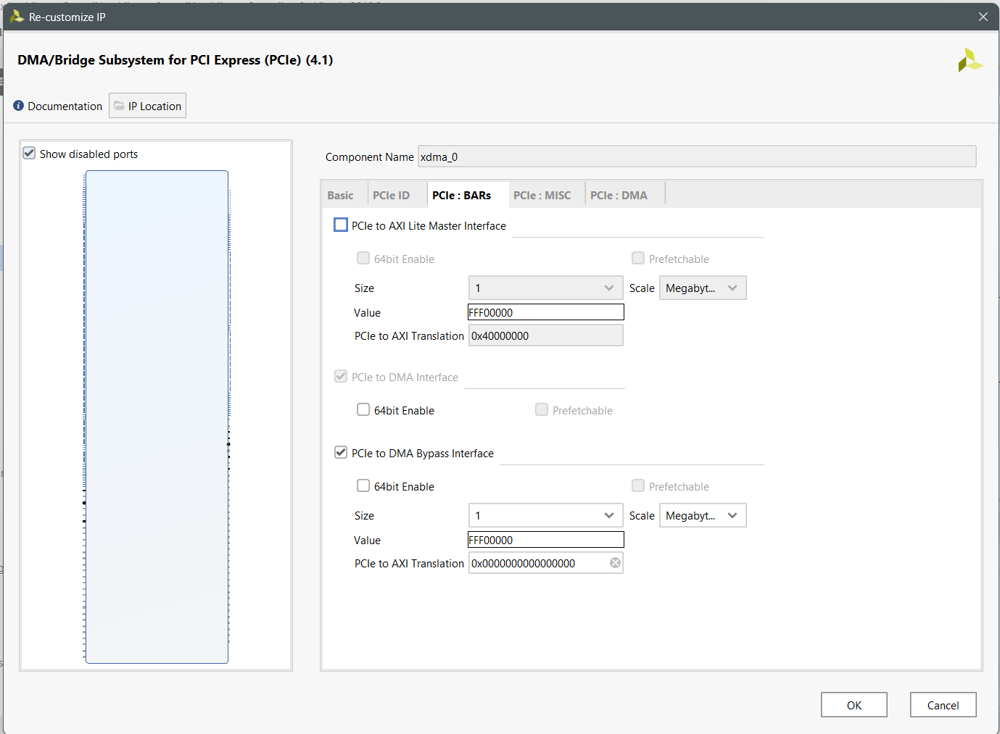
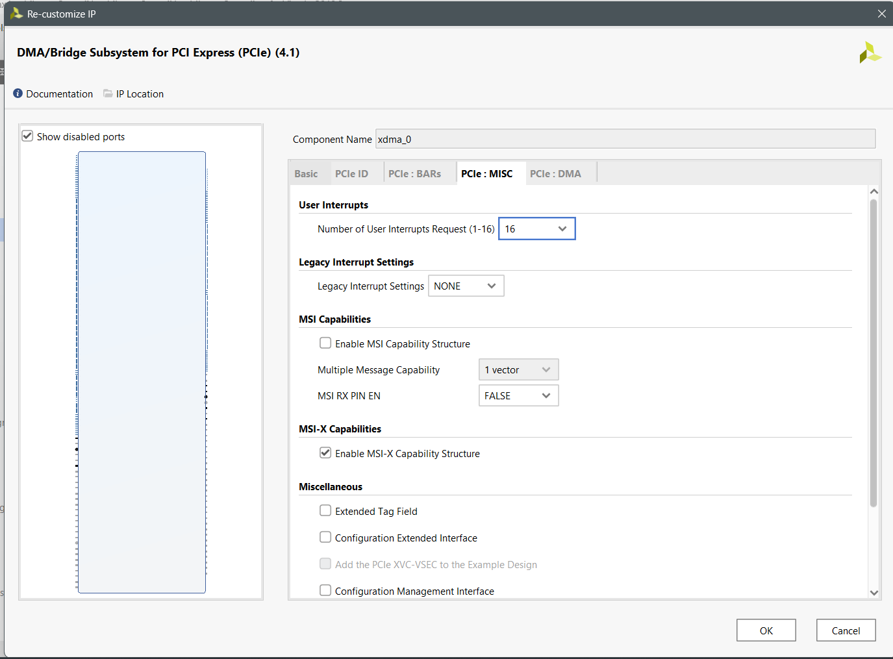
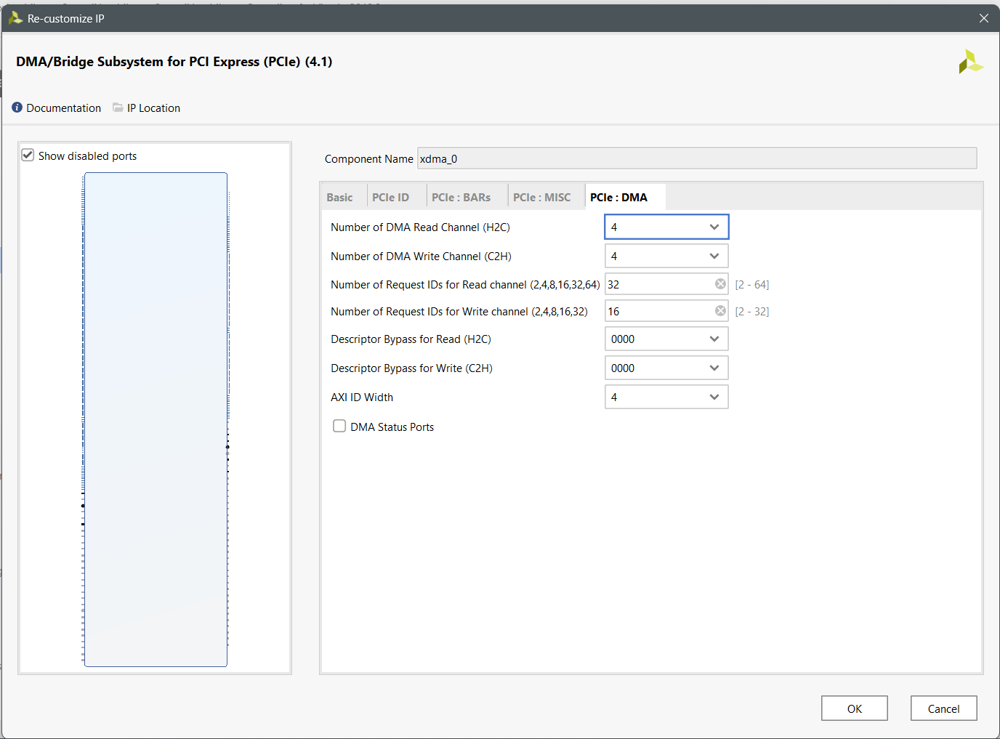
其余页配置如上所示，按默认就好，无需修改。最后一页的H2C与C2H数目代表并行传输的通道数，可按需修改，不过要在主机软件端同步自行修改。

---
### AXI Clock Converter Config
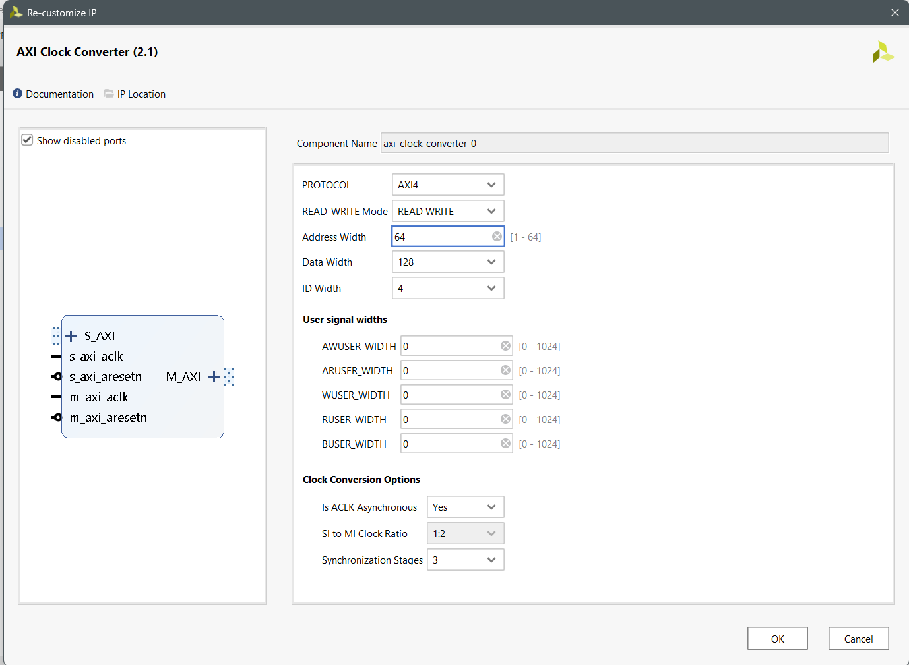
使用该模块是因为PCIe部分与加速器部分在不同时钟域，配置如上即可，Data Width可根据XDMA配置对应设置。

---
### AXI BRAM Controller Config
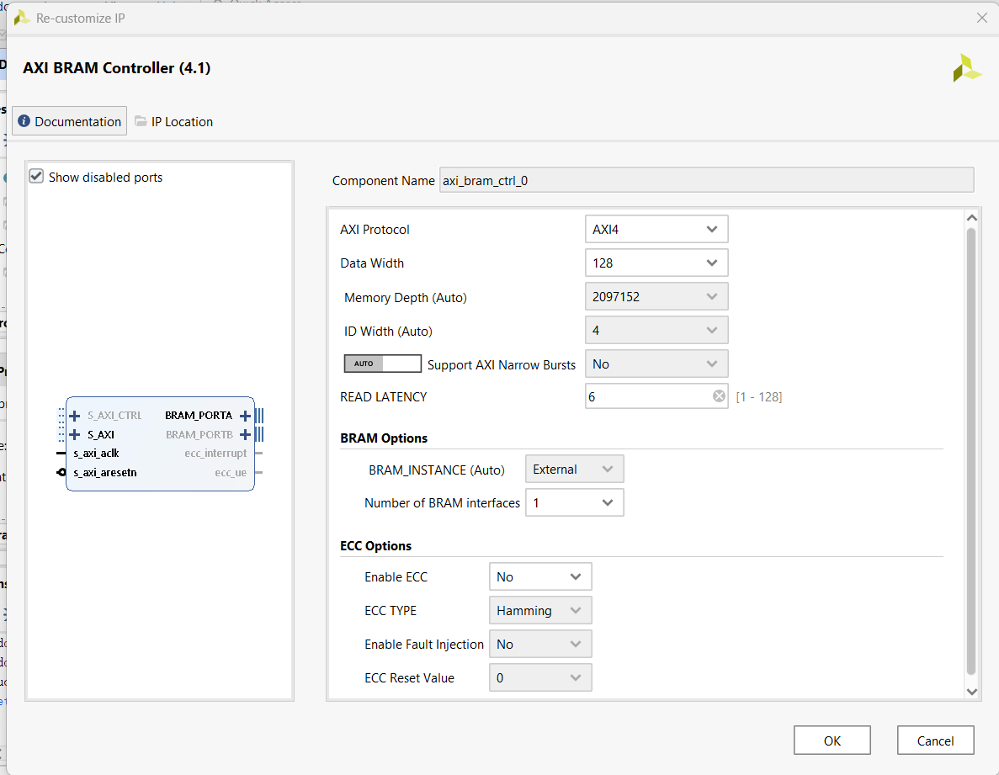
配置如上即可，注意设置READ LATENCY，根据自己的项目中BRAM的读取延迟设置，当前项目中设置为6，即读地址后的第六个周期读出数据。

---
### Clocking Wizard Config
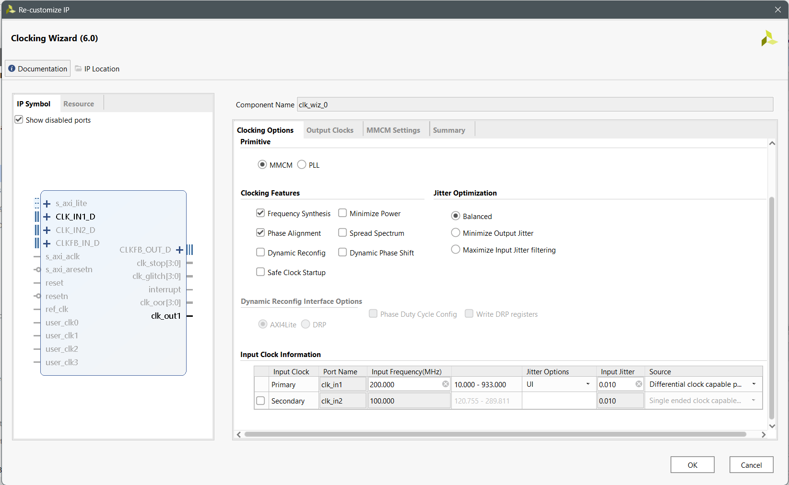
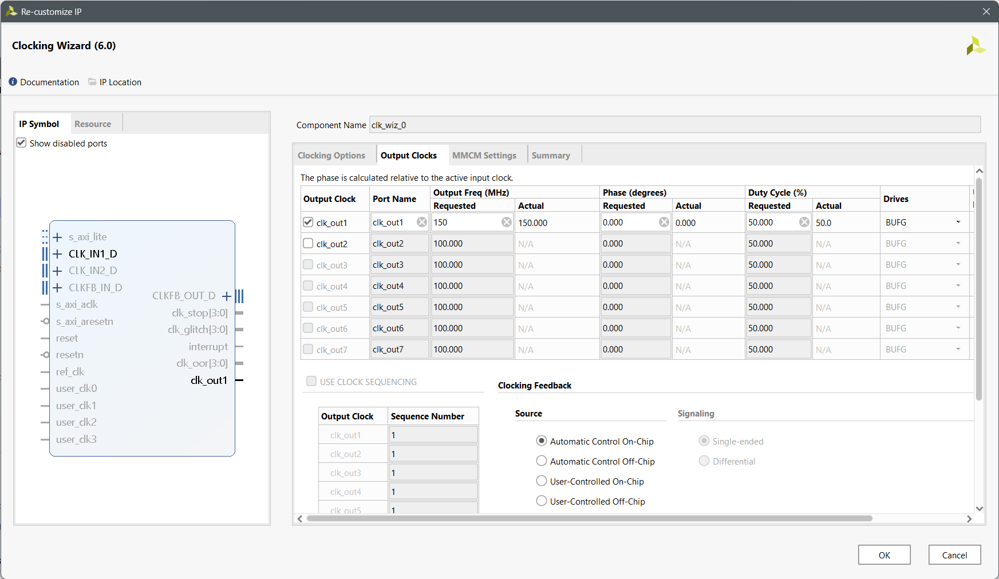
时钟产生按需设置，产生的时钟供加速器部分使用，PCIe部分有自己专用的时钟。

---
### Constant Config
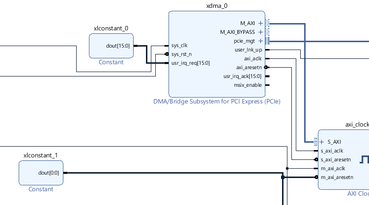
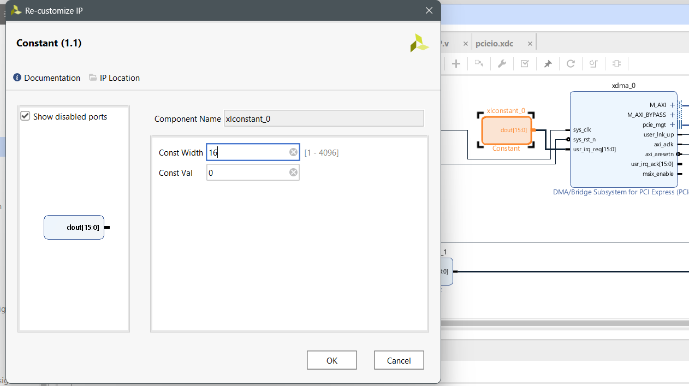
PCIe中断端接全0，本项目中未使用到中断。
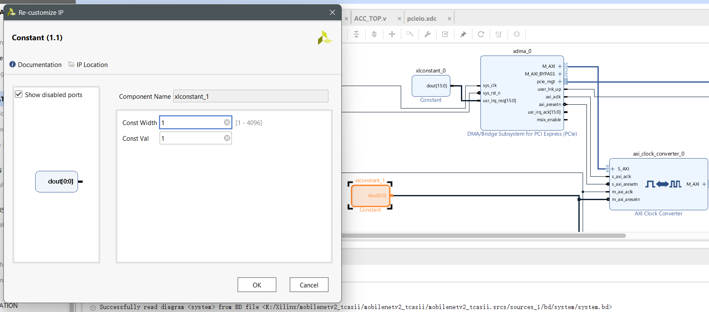
Clock Converter复位端接1，保证常工作。

---

### 地址配置
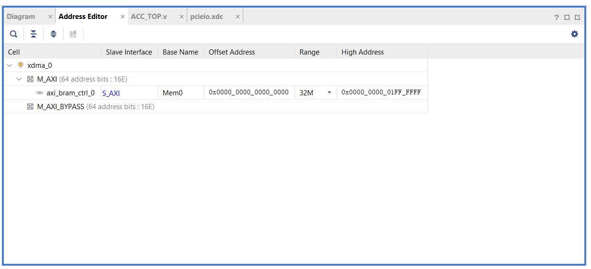
本项目为满足并行计算的位宽需求，将片上 BRAM 配置为单地址对应 72bit 位宽的存储模式；而 AXI 总线采用字节寻址规范（单地址对应 8bit/1Byte），单拍突发传输位宽为 128bit。在 Linux 主机上进行数据传输时，只需要调用dma_file_transfer.sh就可以实现读写。为最大化总线传输效率，本项目采用如下位宽匹配、地址映射与地址空间规划方案。
- **数据位宽匹配方案**
针对 AXI 总线 128bit 传输位宽与 BRAM 72bit 存储位宽的差异，读写通道分别采用如下适配策略：
写通道（AXI → BRAM）：AXI 写传输仅采集数据总线的低 72bit 作为有效数据写入 BRAM；上位机传输程序需提前完成数据格式对齐：每 72bit 有效数据后拼接 56bit 无效填充位（固定为 0），组成 128bit 的 AXI 单拍传输数据单元，匹配总线位宽要求。
读通道（BRAM → AXI）：从 BRAM 读出的 72bit 有效数据，通过高位补 56bit 0 的方式扩展为 128bit 完整位宽，直接接入 AXI 读数据端口，完成总线侧的位宽适配。
- **地址映射规则**
1 个 BRAM 地址对应的 72bit 有效数据，映射到 AXI 总线需占用 16Byte（128bit）的地址空间，即1 个 BRAM 地址对应 16 个 AXI 字节地址。
因此在AXI与BRAM连接时，需舍弃 AXI 地址的低 4 位（字节偏移位），BRAM 地址与 AXI 地址的映射关系为：BRAM_addr = AXI_addr[24:4]
该规则下，AXI 每完成 1 次 128bit 数据传输，AXI 地址自增 16，对应 BRAM 地址自增 1，实现地址空间的一一匹配。
以 Data BRAM 0 为例，其对应片选信号为1、BRAM 侧起始地址为 0，则 BRAM 地址线应设置为21'h010000；对应 Linux 主机端（字节寻址）的起始地址为0x0100000。由于系统每次传输 128 位（16 字节），主机端地址变化为0x0100000, 0x0100010, 0x0100020，对应加速器端口 BRAM 地址变化为21'h010000, 21'h010001, 21'h010002，从而实现正确的写入。
-  **地址空间规划**
本项目共使用 19 路独立 BRAM，单路 BRAM 最大存储深度为 64KB，对应地址位宽为 16bit（[15:0]）；额外分配 5bit 地址线作为 BRAM 片选信号（支持最大 32 路 BRAM 扩展），因此 BRAM 侧总计需要 21bit 地址位宽。
结合上述地址映射规则（AXI 地址低 4 位不参与 BRAM 寻址），AXI 总线侧需提供25bit 地址位宽。AXI 总线为字节寻址，因此需为该项目分配32MB（2^25 Byte）的连续地址空间。
为了实现片选功能，首先要在顶层模块中加入对应的控制逻辑。这部分可以参考`system_top.v`。另外对于 **数据传输/加速器推理** 的状态控制，本设计中通过检测`pcie_addr` 和 `pcie_data_in`来实现，只有向特定位置写入特定数值，才能实现状态的切换。

---

### 主机与FPGA板连接
在完成以上步骤后，将FPGA板与主机通过PCIe线连接，并通过Vivado将加速器的程序烧录到FPGA板上，然后再开启主机。**注意：如果在主机开启的情况下进行烧录，主机会完全卡住。**
随后将`xdma`文件夹拷到主机上，进入`xdma/driver/tests`打开终端，就可以开始验证是否成功建立数据通信。

---

## 上板验证
建立起Linux主机与VC709的通信后，接着可以进行单张图片的推理测试。在终端中先后执行`python3 ifmap_preprocess.py`和`python3 inference_one_image.py`，终端会打印出该图片的top5分类结果。单张图片的推理过程分为以下阶段：
写输入-写权重-写M1-开始推理-检查是否推理完成-结束推理-读取结果-分类
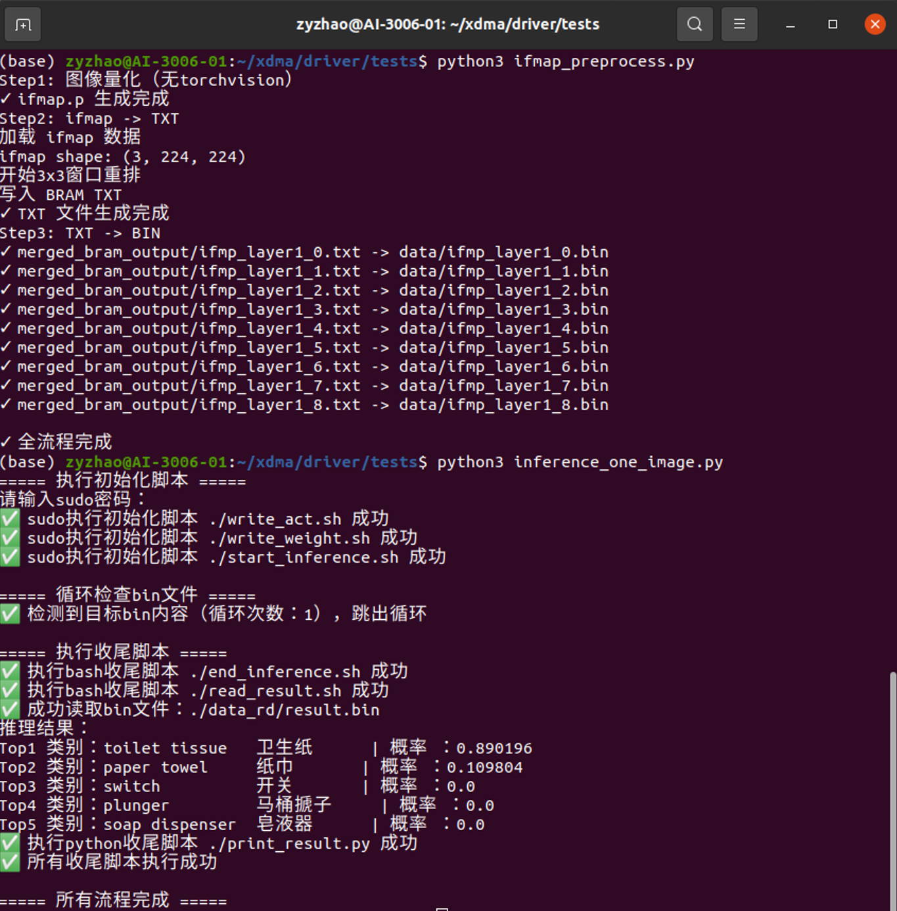
单张图片推理成功之后，可以进行整个Imagenet验证集的验证。
首先需要在`batch_eval_fpga.py`的`USER_CONFIG`中设置好相应的路径，包括验证集，GT Label等。终端打印推理进度的频率可以通过设置`verbose_every`来修改。设置完成后，在终端中运行`python3 batch_eval_fpga.py`，输入一次当前用户的密码，即可开始推理。
验证过程中，每一张图片大约需耗时1.2s，完整验证Imagenet验证集的50000张图片需要约17小时。
为了避免验证过程中电脑宕机等意外情况导致进度丢失，程序运行过程中每完成一张图片的推理就会更新一次检查点。在有检查点的情况下，启动程序时会提示是否要从上次进度继续。
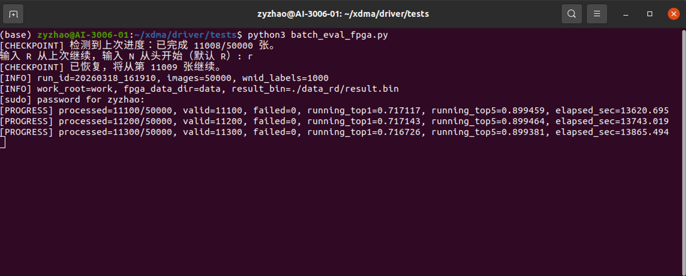

---
## 图形化界面
在终端中运行`sudo -v`授权后，可以通过执行`python3 ui_fpga_app.py`来打开图形化界面。可以通过拖拽或是选择来打开需要进行推理的图像或文件夹。推理完成后，top5推理结果会显示在窗口右侧。若是多张图片的推理，则可以左右切换图片来查看结果，且所有图片推理完成后，程序会输出推理结果的csv文件到`ui_outputs`文件夹。
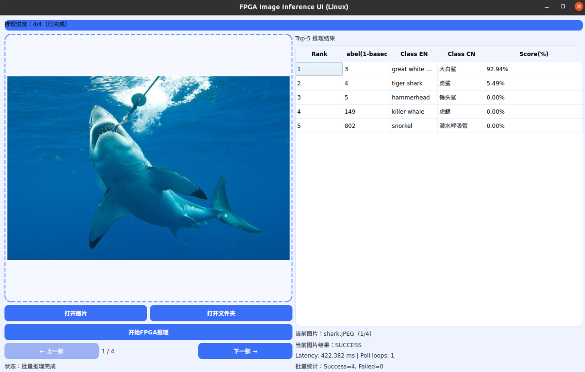
# 五、一些问题的解决过程


## 硬件设计的结果与pytorch模型的输出结果不一致
- **问题**：本项目使用numpy搭建的神经网络模型实际输出结果和torchvision.models.quantization.mobilenet_v2输出的结果一定程度上的不同
- **原因**：是所使用的M0 M1的精度有所不同。其中，本项目中使用的精度是int32，而在torchvision的模型中使用的精度是float64。

- **解决方法**：compare_each_layer的python代码中，使用的是numpy搭建的神经网络，读取torchvision模型中的input_scale, output scale, bias, weight scale，并用于计算M0 M1，使用float64精度。并且将torchvision模型的每一层的输入送入该模型中，避免产生累积误差。最后对每一层的输出进行比较。从运行结果中可以直观地看出，只有第51层输出中有5个数不同，其余层都是完全相同的。
然而，如果使用round对M0 M1进行处理，则会导致两个模型之间每一层输出都有一定程度上的差异。例如，在使用dog.jpg这张图片作为输入的时候，最终输出只有20%左右的数字是一样的。
但为了在设计的加速器上实现该神经网络，本项目必须使用int32作为M0 M1的精度。为了了解这样做对图像分类任务的效果造成的影响，在MobileNetV2_numpy_imagenet.py中使用了int32精度的M0 M1，并对Imagenet的验证集的50000张图片进行推理，accuracy为top1：71.61%，top5：90.11%。而torchvision的模型的accuracy为**top1：71.71% top5：90.25%**。这样的精度损失是完全可以接受的。

---

## 报错: RuntimeError: Quantized backend not supported
原因：当前环境不支持量化操作所需要的后端

问题原因：'qnnpack’是一种专为 ARM CPU 设计的量化后端，而 ‘fbgemm’ 则是一种适用于 x86 CPU 和 ARM CPU 的通用量化后端。

解决方法：修改torchvision中mobilenetv2的第74行，将backend从qnnpack改为fbgemm，如图：
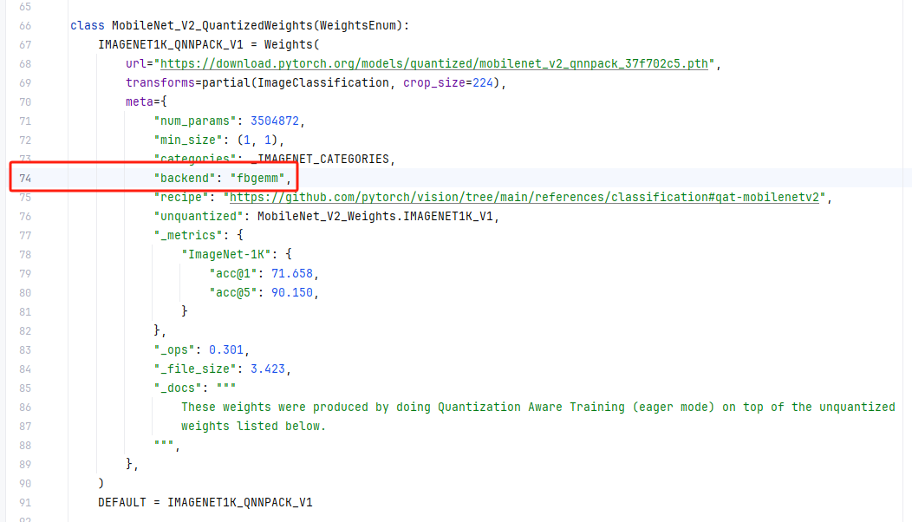


---

## 机箱短路
现象：把VC709直接放置在机箱上容易造成短路，导致FPGA指示灯不亮，且“粘连”在机箱上

问题原因：这是由于FPGA后方直接暴露了焊点，容易与金属机箱接触短路。

解决方法：在FPGA与机箱接触的地方垫一层绝缘层，通常泡沫纸，硬纸板都可以。

---
## 无法开机
现象：将VC709与Linux主机通过PCIe延长线连接之后，出现了主机开机时卡在Logo界面，xdma user_link_up正常发光，但主机无法进入系统的情况。

问题原因：xdma ip配置错误

解决方法：具体参考[WangXuan95/Xilinx-FPGA-PCIe-XDMA-Tutorial: Xilinx FPGA PCIe 保姆级教程 ——基于 PCIe XDMA IP核](https://github.com/WangXuan95/Xilinx-FPGA-PCIe-XDMA-Tutorial)，尤其是PCIE ID那一页下方保持相同即可

---
## 编译xdma报错mmiowb相关问题
现象：在编译linux系统中的xdma代码时系统报错，无法编译。

原因：linux内核更新后不支持旧方法，在ubuntu20以后需要更新编译方法

解决方法：参考[WangXuan95/Xilinx-FPGA-PCIe-XDMA-Tutorial: Xilinx FPGA PCIe 保姆级教程 ——基于 PCIe XDMA IP核](https://github.com/WangXuan95/Xilinx-FPGA-PCIe-XDMA-Tutorial)项目中的pull request # 3可以解决。使用 gh pr checkout 3切换分支。

---
## 运行load_driver.sh脚本报错: `not found.sh: 3`:
现象：编译完成后运行相关测试脚本报错。

原因：原脚本使用windows中的换行符，直接在linux中使用会报错。

解决方法：在终端中使用dos2unix命令转换格式。其余相关脚本均需要转换。

---
## 0地址读写出错
现象：实际读写过程中0x00000000地址读写无法匹配，读出的数据并不是写入的数据

原因：当前axi_bram控制模块会在写边界中把地址拉为0，同时写使能会随机拉高导致零地址数据被覆盖。

解决方法：避免使用0x00000000地址。

---
## 读写数据不匹配，不匹配位置随机发生
现象：实际读写过程中随机出现一些地址读写无法匹配，读出的数据并不是写入的数据

原因：代码中可能存在一些latch，FPGA无法实现。

解决方法：检查代码，避免使用latch。

---
## 读数据错位
现象：读出数据后发现数据错位，甚至出现一些重复的数据覆盖了原数据。

原因：axi_bram_control读延迟未正确设置。

解决方法：正确设置axi_bram_control读延迟，本项目延迟设置为6，即读地址发出后六个时钟周期返回对应读数据。


# 六、项目背景
本项目由赵忠宇、陈家宝于2021年实现了软件设计部分和硬件设计的主要模块。谢易达于2025年完善了硬件设计部分，并增加了用于验证结果的软件部分。王廉丰于2026年完成了PCIe通信以及最终的上板验证部分。
